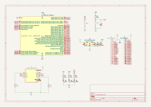
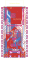
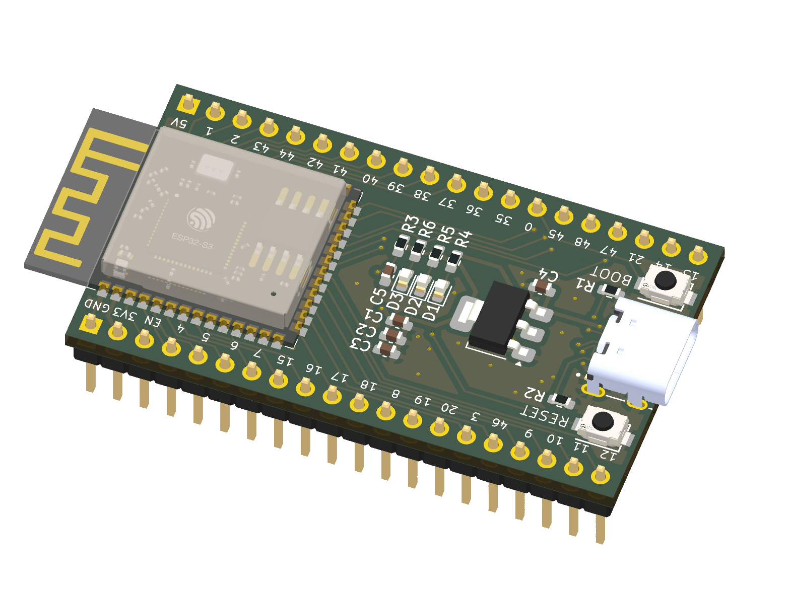

# Very Basic ESP32-S3 Dev Board

More details available with this video [here](https://youtu.be/YMnd2NHENCI)

This is a super simple ESP32-S3 Dev Board with the bare mininum required to get it working.

We have:

- USB-C connector with 5.1K pull down resistors on CC1 and CC2
- 3V3 LDO Regulator
- Decoupling Capacitors
- indicated LEDs - 5V, 3V3, GPIO21

Things that we don't have:

- Additonal ESD protection on the USB port
- Battery charging and power path control
- Any exciting peripherals

## Schematic

- View the schematic PDF: [docs/schematic.pdf](docs/schematic.pdf)

## PCB

- 3D Model (STEP): [docs/dev-board.step](docs/dev-board.step)

